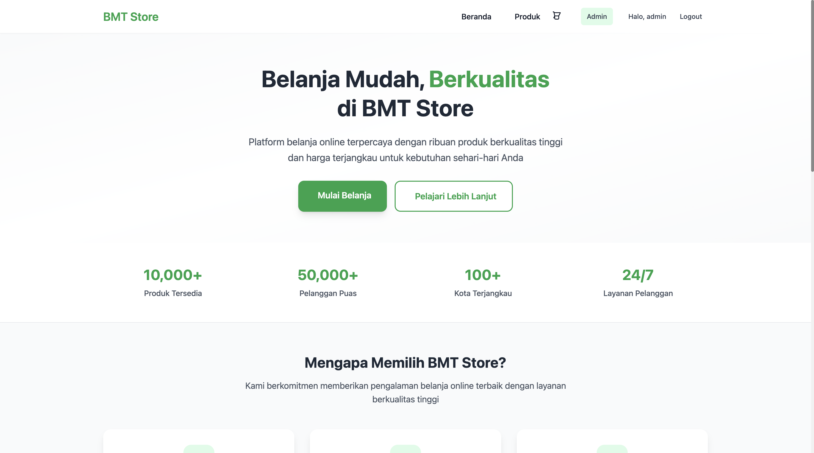

# BMT Mini E-Commerce



Aplikasi e-commerce mini yang dibangun dengan Laravel 12 sebagai case study untuk posisi Fullstack Developer di KSPPS BMT Beringharjo Yogyakarta.

## 📋 Deskripsi Project

BMT Mini E-Commerce adalah aplikasi web e-commerce sederhana yang menyediakan fitur-fitur dasar untuk toko online, termasuk katalog produk, keranjang belanja, sistem checkout, dan panel admin untuk manajemen produk.

## ✨ Fitur Utama

### Frontend (Customer)

-   **Homepage** - Tampilan utama dengan produk unggulan
-   **Katalog Produk** - Daftar semua produk dengan pagination, search, dan sorting
-   **Detail Produk** - Informasi lengkap produk dengan opsi tambah ke keranjang
-   **Keranjang Belanja** - Manajemen item keranjang dengan session-based storage
-   **Checkout** - Proses pembelian dengan konfirmasi
-   **Authentication** - Sistem login/register menggunakan Laravel Sanctum

### Backend (Admin)

-   **Admin Dashboard** - Statistik dan overview toko
-   **Manajemen Produk** - CRUD lengkap untuk produk (Create, Read, Update, Delete)
-   **Upload Gambar** - Sistem upload gambar produk dengan validasi
-   **API Endpoints** - RESTful API untuk semua operasi

### Teknologi & Fitur Teknis

-   **Framework**: Laravel 12
-   **Database**: MySQL
-   **Frontend**: Blade Templates + Tailwind CSS + Flowbite
-   **Authentication**: Laravel Sanctum (API Tokens)
-   **File Storage**: Laravel Storage (Symbolic Link)
-   **Pagination**: Custom AJAX pagination
-   **CSRF Protection**: Laravel CSRF dengan exclusion untuk API
-   **Session Management**: Database session untuk guest cart
-   **Responsive Design**: Mobile-first dengan Tailwind CSS

## 🚀 Instalasi dan Setup

### Prasyarat

-   PHP 8.2 atau lebih tinggi
-   Composer
-   MySQL/MariaDB
-   Node.js & NPM (opsional, untuk development)

### Langkah Instalasi

1. **Clone Repository**

    ```bash
    git clone <repository-url>
    cd bmt-mini-ecommerce
    ```

2. **Install Dependencies**

    ```bash
    composer install
    ```

3. **Environment Setup**

    ```bash
    cp .env.example .env
    php artisan key:generate
    ```

4. **Database Configuration**
   Edit file `.env` dan sesuaikan konfigurasi database:

    ```env
    DB_CONNECTION=mysql
    DB_HOST=127.0.0.1
    DB_PORT=3306
    DB_DATABASE=bmt_mini_ecommerce
    DB_USERNAME=root
    DB_PASSWORD=zyxkoo
    ```

5. **Database Setup**

    ```bash
    php artisan migrate:fresh --seed
    php artisan storage:link
    ```

6. **Jalankan Aplikasi**

    ```bash
    php artisan serve
    ```

    Aplikasi akan berjalan di `http://localhost:8000`

## 📚 Dokumentasi API

### Authentication Endpoints

```
POST /api/auth/register    - Register user baru
POST /api/auth/login       - Login user
POST /api/auth/logout      - Logout user (protected)
GET  /api/auth/profile     - Get user profile (protected)
```

### Product Endpoints

```
GET  /api/products         - Get products with pagination, search, sorting
GET  /api/products/{id}    - Get single product detail
```

### Cart Endpoints

```
GET    /api/cart           - Get cart items
GET    /api/cart/count     - Get cart items count
POST   /api/cart/add       - Add item to cart
DELETE /api/cart/{id}      - Remove item from cart
```

### Checkout Endpoints

```
POST /api/checkout         - Process checkout
```

### Admin Endpoints (Protected)

```
GET    /api/admin/products         - Get all products (admin)
POST   /api/admin/products         - Create new product
GET    /api/admin/products/{id}    - Get product detail
PUT    /api/admin/products/{id}    - Update product
DELETE /api/admin/products/{id}    - Delete product
```

### Upload Endpoints (Protected)

```
POST   /api/upload/product-image   - Upload product image
DELETE /api/upload/product-image   - Delete product image
```

## 🗄️ Struktur Database

### Tabel Products

```sql
id (bigint, primary key)
name (varchar 255)
price (decimal 10,2)
stock (integer)
description (text, nullable)
image (varchar 255, nullable)
created_at (timestamp)
updated_at (timestamp)
```

### Tabel Cart

```sql
id (bigint, primary key)
user_id (bigint, nullable, foreign key)
session_id (varchar 255, nullable)
product_id (bigint, foreign key)
quantity (integer)
created_at (timestamp)
updated_at (timestamp)
```

### Tabel Transactions

```sql
id (bigint, primary key)
user_id (bigint, nullable, foreign key)
total (decimal 10,2)
status (varchar 255, default: 'pending')
created_at (timestamp)
updated_at (timestamp)
```

### Tabel Transaction Items

```sql
id (bigint, primary key)
transaction_id (bigint, foreign key)
product_id (bigint, foreign key)
quantity (integer)
price (decimal 10,2)
created_at (timestamp)
updated_at (timestamp)
```

## 🎨 Design Pattern & Arsitektur

### Backend Architecture

-   **MVC Pattern**: Model-View-Controller architecture
-   **Repository Pattern**: Eloquent ORM sebagai data layer
-   **API Resource Pattern**: Consistent API responses
-   **Service Layer**: Business logic separation
-   **Middleware**: Authentication dan CSRF protection

### Frontend Architecture

-   **Component-based**: Reusable Blade components
-   **Progressive Enhancement**: JavaScript untuk interaktivity
-   **Mobile-first**: Responsive design approach
-   **AJAX Pattern**: Dynamic content loading

### Security Features

-   **CSRF Protection**: Laravel built-in CSRF dengan API exclusion
-   **Input Validation**: Server-side validation untuk semua input
-   **File Upload Security**: File type dan size validation
-   **SQL Injection Prevention**: Eloquent ORM protection
-   **Authentication**: Sanctum token-based authentication

## 📱 Screenshots & Demo

### Homepage

-   Clean landing page dengan hero section
-   Featured products grid
-   Navigation dengan cart counter

### Product Catalog

-   Pagination dengan 12 produk per halaman
-   Search functionality dengan debounce
-   Sorting by name, price, stock, dan date
-   Responsive grid layout

### Product Detail

-   Image preview
-   Product information
-   Quantity selector
-   Add to cart functionality

### Shopping Cart

-   Item list dengan image preview
-   Quantity dan subtotal display
-   Remove item functionality
-   Checkout dengan modal confirmation

### Admin Panel

-   Dashboard dengan statistics cards
-   Product management dengan CRUD operations
-   Image upload dengan drag & drop
-   Responsive table dengan search dan pagination

## 🧪 Testing

### Manual Testing Checklist

-   ✅ Product listing dan pagination
-   ✅ Product search dan sorting
-   ✅ Add to cart functionality
-   ✅ Cart management (add/remove items)
-   ✅ Checkout process
-   ✅ User registration dan login
-   ✅ Admin product CRUD operations
-   ✅ Image upload functionality
-   ✅ API endpoints dengan proper responses
-   ✅ Responsive design di berbagai device

### Test Data

-   24 sample tech products sudah tersedia
-   Default admin user: test@example.com
-   Sample categories: Laptop, Smartphone, Peripherals, Components

## 🚧 Development Notes

### Known Limitations

-   Belum ada payment gateway integration
-   User management terbatas pada basic auth
-   Belum ada order history untuk customers
-   Belum ada email notifications
-   Belum ada product categories sistem

### Future Enhancements

-   Payment gateway integration (Midtrans/Xendit)
-   Order tracking dan history
-   Product review dan rating system
-   Email notifications untuk orders
-   Advanced admin reporting
-   Multi-language support
-   SEO optimization

## 🤝 Contributing

Ini adalah project case study. Untuk feedback atau saran, silakan hubungi developer.

## 📄 License

This project adalah case study untuk interview purpose. All rights reserved.

## 👨‍💻 Developer

**Case Study untuk KSPPS BMT Beringharjo**

-   Position: Fullstack Developer
-   Tech Stack: Laravel 12, MySQL, Tailwind CSS, JavaScript

---

_Dibuat dengan ❤️ untuk case study Fullstack Developer KSPPS BMT Beringharjo Yogyakarta_
